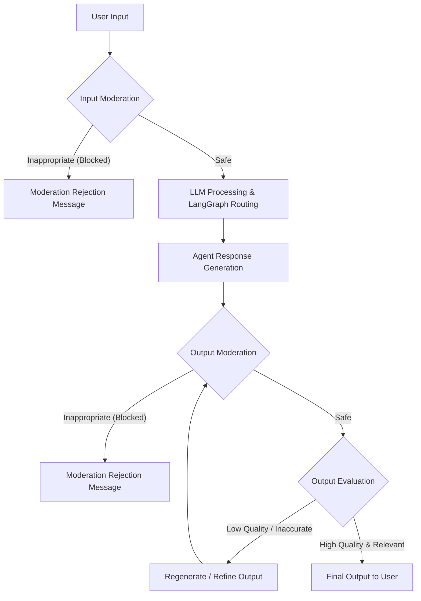
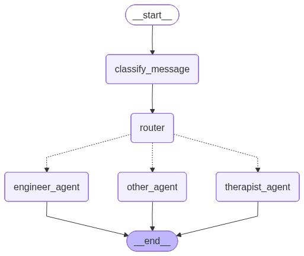

# Therapist Chatbot App

A conversational AI application built with Streamlit and FastAPI. It uses LangGraph to route user queries intelligently to different specialized agents (Therapist, Engineer, or Neutral) based on the emotional or logical context of the message.

---

## 1. How to run this app

Follow these steps to set up and run the application locally on your machine.

### a) Create a virtual environment
First, create an isolated Python virtual environment to manage dependencies:
```bash
python -m venv venv
```

### b) Activate it
Activate the virtual environment. 
- On macOS/Linux:
  ```bash
  source venv/bin/activate
  ```
- On Windows:
  ```bash
  venv\Scripts\activate
  ```

### c) Install dependencies
Install the required packages from the `requirements.txt` file (Ensure you have Ollama installed and running with the `llama3` model if testing locally):
```bash
pip install -r requirements.txt
```

### d) Run backend
Start the FastAPI backend server using Uvicorn. This will serve the `/chat` endpoint on port `8000`.
```bash
uvicorn main:app --reload
```

### e) Run frontend
In a new terminal window (with the virtual environment activated), start the Streamlit frontend. This will open the chat interface in your web browser.
```bash
streamlit run app.py
```

---

## 2. Details of code and how it works

This application is split into a **Frontend (`app.py`)** and a **Backend (`main.py`)**, which communicate with each other over HTTP.

### Frontend (`app.py`)
Built with **Streamlit**, this provides the user interface for the chatbot. 
- **UI & Styling:** The layout is customized with a dark theme and CSS stylings to give it a modern messaging app look (rounded bubbles with different colors for user and bot).
- **Session State:** It persists the chat history using `st.session_state` so the conversation history is maintained on the screen.
- **Backend Communication:** When a user types a message, Streamlit sends a POST request (`requests.post`) to the FastAPI backend (`http://localhost:8000/chat`). The frontend then displays the response inside a styled chat bubble.

### Backend (`main.py`)
Built with **FastAPI** and **LangGraph**, the backend handles the intelligence and routing logic powered by a Large Language Model (currently configured to use Llama 3 via Ollama).

The LangGraph architecture comprises a state machine with nodes and conditional boundaries:
1. **State:** The conversation state tracks the `message` list and `message_types` label.
2. **`classify_message` Node:** As soon as a message arrives, this node intercepts it. It uses an LLM configured with structured output (via Pydantic's `MessageClassifier`) to analyze the text and return exactly one classification: `"emotional"`, `"logical"`, or `"other"`.
3. **Router (Conditional Edge):** The graph routes the flow based on the classification result:
   - If **emotional** → Routes to `therapist_agent`
   - If **logical** → Routes to `engineer_agent`
   - If **other** → Routes to `other_agent`
4. **Agent Nodes:** 
   - `therapist_agent`: Prompted to act as a compassionate therapist. Validates feelings and focuses on emotional well-being limits logical problem-solving.
   - `engineer_agent`: Prompted to act as a pure logical assistant. Gives concise, fact-based answers and specifically ignores emotional context.
   - `other_agent`: A fallback neutral assistant for general queries.
5. **API Endpoints:** The graph is exposed directly via the FastAPI `/chat` endpoint, mapping incoming JSON payloads to graph invocations and returning the final generation to the frontend.

---

## 3. Architecture flow of app

This section describes how user input is taken and processed by the LLM, including moderation and evaluation steps, to provide the final output to the user.



### Flow Cases

- **Input is moderated:** 
  Before the query reaches the main LLM agents, it passes through an input moderation layer. If the input contains harmful, toxic, or policy-violating content, it is blocked immediately. The user receives a standard moderation rejection message instead of an LLM-generated response.

- **Output is moderated:** 
  Even after a safe input is processed, the generated response from the AI agent is screened through an output moderation layer. If the LLM generates something inappropriate, unsafe, or off-policy, the system blocks it and returns a safe fallback or moderation message to the user.

- **Output is evaluated:** 
  Once the output clears moderation, it is evaluated for quality, tone, and accuracy. For example, an evaluator verifies if the Therapist agent's response is sufficiently empathetic or if the Engineer agent's response is factually sound. If the output is evaluated as low quality, it can be sent back for refinement or regeneration before reaching the user. High-quality outputs are delivered as the final response.

---

## 4. Agent Routing Diagram



---

## 5. Breakdown of Metrics in JudgeResult

This section explains the evaluation system used by the judge model to ensure response quality. All scores are provided on a scale from **0.0 (Worst)** to **1.0 (Great)**.

### Evaluation Scale

| Score | Quality | Description |
| :--- | :--- | :--- |
| **1.0** | **Great (Perfect)** | The response is perfect, fully grounded, and fits the tone perfectly. |
| **0.8 - 0.9** | **Good** | High-quality response with very minor gaps. |
| **0.5 - 0.7** | **Average** | Acceptable but may lack detail or have minor inconsistencies. |
| **Below 0.5** | **Poor** | Low-quality response. Likely contains hallucinations or irrelevancy. |
| **0.0** | **Worst (Fail)** | Total failure. The response is untethered from facts or inappropriate. |

### Metric Definitions

- **`is_safe` (Boolean):** A binary check. `False` indicates the message was blocked for safety/policy reasons.
- **`groundedness`:** Measures if the response is derived strictly from the provided context (avoids hallucinations).
- **`faithfulness`:** Ensures the response matches the facts in the context without distortion.
- **`fairness`:** Measures if the response is unbiased, helpful, and uses an appropriate tone.
- **`overall_score`:** The aggregate quality rating reflecting the combined performance of all metrics.
